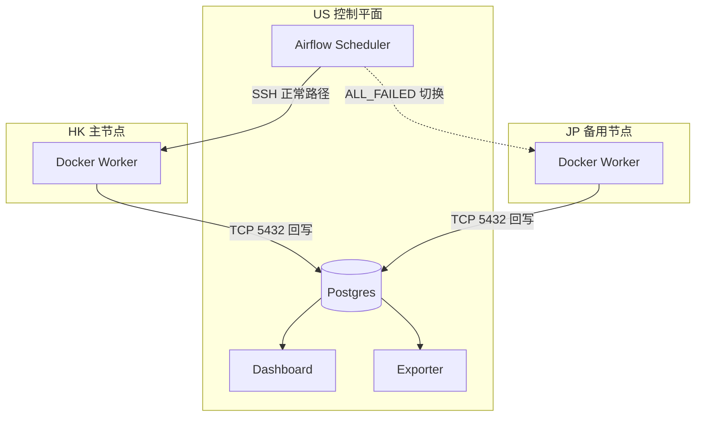

# Resilient Market Data Pipeline

> 面向跨区域弱网与节点故障场景的市场数据采集与主备切换流水线。

[]() []() []() []()

快速导航：[项目概览](#overview) · [阅读路径](#start-here) · [架构概览](#architecture) · [快速开始](#quickstart) · [文档导航](#docs-map) · [当前限制](#limitations)

## <a id="overview"></a>项目概览

本项目实现了一条以 Airflow 为控制平面的市场数据采集链路：US 节点负责调度与存储，HK 节点承担常规抓取，JP 节点在主节点失败时接管任务。采集结果统一写回 US 上的 Postgres，并通过 `source_region` 保留来源标签，便于审计、回放和运行排查。

当前仓库重点覆盖以下能力：

- **主备切换**：`airflow/dags/binance_dag.py` 使用 `SSHOperator` 调度远端 worker，并以 `TriggerRule.ALL_FAILED` 触发 JP 接管
- **幂等写入**：`infra/init-db/01_init.sh` 与 `crawler/main.py` 共同定义 `UNIQUE(symbol, interval, open_time)` + upsert 写入约束
- **运行观测**：`dashboard/app.py` 展示价格走势、当前节点来源与 failover 轨迹
- **下游导出**：`exporter/export_data.py` 将近 24 小时数据导出到 `data_lake/binance_data_lake/`

## <a id="start-here"></a>阅读路径

- **30 秒**：先看 [`docs/architecture_design.md`](docs/architecture_design.md) 里的拓扑，再看 [`docs/validation/README.md`](docs/validation/README.md) 中的运行快照
- **3 分钟**：依次浏览下方“架构概览”“关键组件”“数据模型与写入约束”，快速建立系统边界
- **本地启动**：直接按 [快速开始](#quickstart) 运行控制平面，再结合 [`docs/runtime_checks.md`](docs/runtime_checks.md) 做验证
- **服务器部署**：查看 [`DEPLOYMENT_GUIDE.md`](DEPLOYMENT_GUIDE.md) 与 [`docs/TROUBLESHOOTING.md`](docs/TROUBLESHOOTING.md)

## <a id="architecture"></a>架构概览



- US 节点集中运行 Airflow 与 Postgres，是控制与存储的汇聚点
- HK 节点负责常规抓取；当 `crawl_primary_hk` 失败时，JP 节点通过 `crawl_backup_jp` 接管
- 审计逻辑由 `audit_failover` 读取最新数据来源，识别 `JP-Backup` 并输出告警信息
- 详细设计、组件职责和取舍见 [`docs/architecture_design.md`](docs/architecture_design.md)

## 关键组件

| 组件 | 作用 | 入口 |
|---|---|---|
| `docker-compose.yaml` | 启动 Postgres、Airflow Webserver、Airflow Scheduler | [`docker-compose.yaml`](docker-compose.yaml) |
| 主调度 DAG | 按小时调度 HK 抓取，必要时触发 JP 接管，并执行审计 | [`airflow/dags/binance_dag.py`](airflow/dags/binance_dag.py) |
| 维护 DAG | 清理保留期外数据并执行 `VACUUM ANALYZE` | [`airflow/dags/maintenance_dag.py`](airflow/dags/maintenance_dag.py) |
| 连接初始化脚本 | 注册 `ssh_hk`、`ssh_jp`、`postgres_default` 并激活 DAG | [`airflow/dags/setup_airflow.sh`](airflow/dags/setup_airflow.sh) |
| Worker 抓取程序 | 拉取 Binance OHLCV 并写入 `crypto_data.crypto_klines` | [`crawler/main.py`](crawler/main.py) |
| Dashboard | 展示价格、节点来源与 failover 轨迹 | [`dashboard/app.py`](dashboard/app.py) |
| Exporter | 导出近 24 小时快照到本地 data lake | [`exporter/export_data.py`](exporter/export_data.py) |

## 数据模型与写入约束

业务表为 `crypto_data.crypto_klines`（数据库：`crypto`）。当前最重要的字段与约束如下：

- `symbol`、`interval`、`open_time`：构成时序键，其中 `open_time` 使用毫秒时间戳
- `open_price`、`high_price`、`low_price`、`close_price`、`volume`：行情数值字段
- `source_region`：写入来源标签，当前约定为 `HK-Primary` 或 `JP-Backup`
- `raw_payload`：保留原始响应，便于排查和后续特征扩展
- `UNIQUE(symbol, interval, open_time)`：保证重复运行不会生成重复行

表结构定义见 [`infra/init-db/01_init.sh`](infra/init-db/01_init.sh)，写入逻辑见 [`crawler/main.py`](crawler/main.py)。

## <a id="quickstart"></a>快速开始

以下步骤用于本地控制平面最小启动，不依赖 HK / JP 远端节点。

### 1. 准备配置

```bash
cp .env.example .env
```

随后编辑 `.env`，至少填写：`POSTGRES_PASSWORD`、`AIRFLOW_FERNET_KEY`、`US_IP`。

### 2. 启动数据库并初始化 Airflow

```bash
docker compose up -d postgres
docker compose run --rm airflow-webserver airflow db migrate
docker compose up -d airflow-webserver airflow-scheduler
```

### 3. 基础验证

```bash
docker exec pipeline-db pg_isready -U airflow
curl -s -o /dev/null -w "%{http_code}" http://localhost:8080/health
docker exec pipeline-db psql -U airflow -d crypto -c "\dt crypto_data.*"
```

更多检查命令与 SQL 查询见 [`docs/runtime_checks.md`](docs/runtime_checks.md)。

### 4. 多节点部署

服务器部署、Worker 分发、DAG 激活与日常更新请查看 [`DEPLOYMENT_GUIDE.md`](DEPLOYMENT_GUIDE.md)。

## <a id="docs-map"></a>文档导航

| 文档 | 适用场景 |
|---|---|
| [`docs/README.md`](docs/README.md) | 文档总索引与阅读入口 |
| [`docs/architecture_design.md`](docs/architecture_design.md) | 拓扑、角色划分、切换语义与设计取舍 |
| [`docs/runtime_checks.md`](docs/runtime_checks.md) | 运行检查命令、样例 SQL 与验证口径 |
| [`DEPLOYMENT_GUIDE.md`](DEPLOYMENT_GUIDE.md) | US / HK / JP 多节点部署与更新流程 |
| [`docs/TROUBLESHOOTING.md`](docs/TROUBLESHOOTING.md) | 启动顺序、容器重启等常见问题排查 |
| [`docs/SECURITY.md`](docs/SECURITY.md) | 密钥、端口暴露、权限与剩余风险 |
| [`docs/validation/README.md`](docs/validation/README.md) | 脱敏运行快照与验证结果索引 |
| [`dashboard/README.md`](dashboard/README.md) | Dashboard 本地运行与 systemd 部署 |

## 验证边界

当前仓库没有单元测试框架；运行验证主要依赖以下几类检查：

- **配置与 DAG 导入**：确认 Airflow 能解析 DAG，连接注册成功
- **服务健康**：确认 `pipeline-db`、`airflow-webserver`、`airflow-scheduler` 正常运行
- **数据检查**：通过样例查询、freshness、completeness、duplicate guard 验证写入结果
- **运行快照**：通过 [`docs/validation/README.md`](docs/validation/README.md) 中的截图补充运行状态、切换结果和导出产物

这些验证说明当前实现“能部署、能运行、能切换、能落库”，但不等同于完整的自动化测试覆盖。

## <a id="limitations"></a>当前限制

- 当前实现侧重运维简单性，使用 `Airflow + SSHOperator` 而不是更重的分布式调度栈
- Postgres 既承载 Airflow 元数据，也承载业务表；更高吞吐场景下需要进一步拆分与隔离
- `postgres:5432` 对 worker 回写开放，生产环境应配合防火墙、白名单或私网访问控制
- Dashboard 与 exporter 更偏运行观测与数据快照，不承担复杂权限管理或多租户能力

## 后续工作

- 为 DAG 导入、基础命令和导出流程补充轻量自动化检查
- 将 freshness / completeness 审计从手工 SQL 提升为周期性任务
- 收紧数据库、SSH 与 Web 界面的默认暴露面
