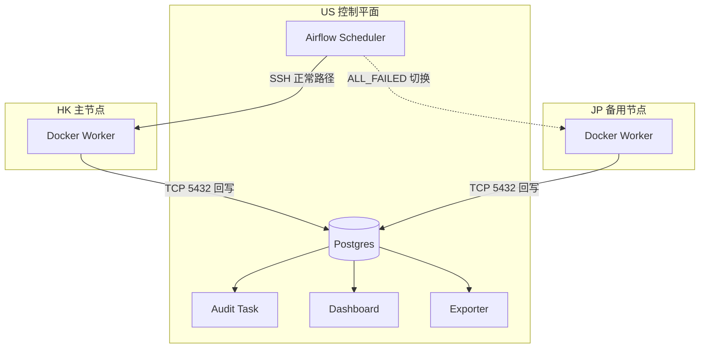

# 架构设计

本页说明系统为什么采用当前拓扑、各组件承担什么职责，以及主备切换在运行时如何触发。

相关文档：[`../README.md`](../README.md) · [`README.md`](README.md) · [`runtime_checks.md`](runtime_checks.md) · [`validation/README.md`](validation/README.md) · [`../DEPLOYMENT_GUIDE.md`](../DEPLOYMENT_GUIDE.md)

## 背景与目标

本项目面向跨区域弱网场景下的市场数据采集问题。核心目标不是构建大规模调度平台，而是在主抓取节点网络异常时，尽量减少时间序列断点，并保留足够的来源信息以支持后续审计与排查。

当前设计重点覆盖：

- 在 HK 主节点失败时自动触发 JP 备用节点
- 将所有抓取结果统一写回 US 节点上的 Postgres
- 通过 `source_region` 保留来源标签，便于区分 `HK-Primary` 与 `JP-Backup`
- 通过 Dashboard 与导出脚本提供基础运行观测与下游快照

## 设计取舍

### 1. 为什么使用 Airflow + SSHOperator

- 当前规模更适合使用单点控制平面 + 远端无代理调度，而不是引入更重的集群编排系统
- `SSHOperator` 可以直接在远端节点执行 `docker run`，减少 worker 侧额外服务依赖
- 代价是调度与控制集中在 US 节点；如果控制平面不可用，切换能力也会受到影响

### 2. 为什么采用主备而不是双活

- 当前任务以小时级抓取为主，优先解决“主节点失败时是否能补位”，而不是追求双活一致性
- 主备模式实现简单，切换语义清晰，也更容易通过 `source_region` 做回放和审计
- 代价是备用节点平时处于待命状态，资源利用率不是最优

### 3. 为什么集中写回 US Postgres

- 统一存储更便于下游查询、Dashboard 展示与导出
- 表约束与 upsert 逻辑集中在一处，减少跨节点重复处理
- 代价是回写链路依赖 US 节点网络与数据库端口的可达性

## 物理拓扑

## 组件职责

| 组件 | 职责 | 入口 |
|---|---|---|
| US 控制平面 | 运行 Airflow、持有业务表、汇聚运行状态 | [`../docker-compose.yaml`](../docker-compose.yaml) |
| 主调度 DAG | 调度 HK 抓取、在失败时触发 JP、执行审计 | [`../airflow/dags/binance_dag.py`](../airflow/dags/binance_dag.py) |
| 维护 DAG | 清理过期数据并执行 `VACUUM ANALYZE` | [`../airflow/dags/maintenance_dag.py`](../airflow/dags/maintenance_dag.py) |
| 连接初始化脚本 | 注册 `ssh_hk`、`ssh_jp`、`postgres_default` 并激活 DAG | [`../airflow/dags/setup_airflow.sh`](../airflow/dags/setup_airflow.sh) |
| HK 主节点 | 常规抓取 `BTC/USDT`、`ETH/USDT`、`SOL/USDT`、`DOGE/USDT` 的 `1h` OHLCV | [`../crawler/main.py`](../crawler/main.py) |
| JP 备用节点 | 在 HK 失败时执行同样的抓取逻辑，并以 `JP-Backup` 标签回写 | [`../crawler/main.py`](../crawler/main.py) |
| Dashboard | 读取业务表，展示价格、节点来源与 failover 轨迹 | [`../dashboard/app.py`](../dashboard/app.py) |
| Exporter | 导出近 24 小时快照到 `data_lake/binance_data_lake/` | [`../exporter/export_data.py`](../exporter/export_data.py) |

## 主备切换语义

### 正常模式

1. `crawl_primary_hk` 通过 SSH 在 HK 节点执行 `docker run --rm ... binance-crawler`
2. Worker 从 Binance 拉取最近 24 根 `1h` K 线
3. 抓取结果写入 `crypto_data.crypto_klines`
4. `audit_failover` 读取最新记录，若来源仍为 `HK-Primary`，仅记录正常状态

### 切换模式

1. `crawl_primary_hk` 因网络不可达、超时或远端执行失败而报错
2. `crawl_backup_jp` 由 `TriggerRule.ALL_FAILED` 激活
3. JP 节点执行同样的抓取逻辑，并以 `source_region='JP-Backup'` 回写
4. `audit_failover` 读取最新记录并输出 failover 告警信息
5. Dashboard 与导出脚本继续从同一张业务表读取数据，但可通过 `source_region` 识别来源变化

## 数据与审计约束

- 业务表为 `crypto_data.crypto_klines`
- 约束为 `UNIQUE(symbol, interval, open_time)`，用于避免重复行
- upsert 冲突时会更新 `source_region`、`volume` 与 `updated_at`
- `open_time` 与 `close_time` 都以毫秒存储，查询与展示时需要显式转换

表定义见 [`../infra/init-db/01_init.sh`](../infra/init-db/01_init.sh)，写入逻辑见 [`../crawler/main.py`](../crawler/main.py)。

## 安全边界

- `.env` 用于承载数据库密码、Fernet key 与节点地址，不应提交到版本控制
- `postgres:5432` 需要对 HK / JP 可达，因此生产环境应配合防火墙或私网访问控制
- `setup_airflow.sh` 当前为 SSH 连接启用了 `no_host_key_check`，部署到非受信环境时应收紧主机校验策略
- Airflow Web (`8080`) 与 Dashboard (`8501`) 默认无额外鉴权层，暴露到公网前应补充 TLS 与访问控制

更细的操作建议见 [`SECURITY.md`](SECURITY.md)。

## 相关文档

- 运行检查与查询：[`runtime_checks.md`](runtime_checks.md)
- 运行快照与验证结果：[`validation/README.md`](validation/README.md)
- 服务器部署与更新：[`../DEPLOYMENT_GUIDE.md`](../DEPLOYMENT_GUIDE.md)
- 常见启动问题排查：[`TROUBLESHOOTING.md`](TROUBLESHOOTING.md)
